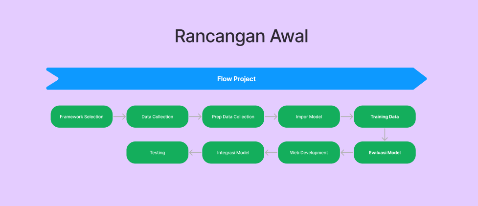

<h1 align="center"> AI Realtime Meeting Summarization </h1>
<p align="center"> Main repository of AMD Pervasive AI Developer Contest @ Infinite Learning of AI Realtime Meeting Summarization. </p>

<div align="center">
    <!-- Your badges here -->
    
    
    
    
    
    
</div>

### Teams

- Maulana Malik [(sasaam)](https://github.com/sasaam)
- Wahyudi 

### Project flow
This is how the project will run, in a simple term :

 

### Project Requirements

- These are requirements for the backend project : 
```
openai-whisper
Flask
PyAudio
pydub
transformers
fpdf
```

- Make new virtual environment with the name 'venv' : 

```
python -m venv venv
```

- Activate it with : 

```
./venv/Scripts/activate
```

- Install requirements

```
pip install -r requirements.txt
```

- Run the server :
```
http://localhost:5000/
```


### Model used

- OpenAI Whisper as Automatic Speech Recognition
- facebook/bart-large-cnn open LLM for Summarize the transcription